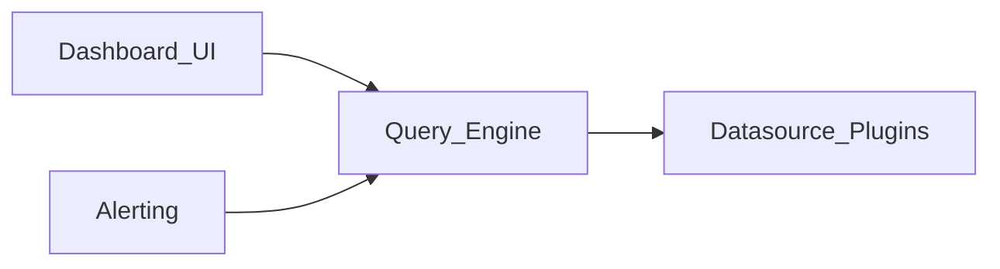

# Grafana RCA educational pack — architecture

> Public stand-in for multi-component observability products. Educational only.

## Components

| Component | Responsibility | Primary repo |
|---|---|---|
| dashboard | Panels, time range, refresh, variables | grafana/grafana |
| datasource | Plugin connections to backends (Prometheus, Loki, …) | grafana/grafana |
| query | Query editor, request lifecycle, timeouts | grafana/grafana |
| alerting | Alert rules, evaluations, notifications | grafana/grafana |

## Design notes

- Dashboards issue queries through datasources; freezes often involve query timeout or refresh loops.
- Alerting shares the query path; “flapping alerts” may be evaluation or datasource latency.
